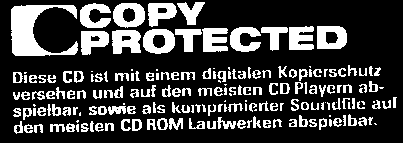

<HTML><HEAD>
<meta name="description" content="Recovering audio cd 'copy protected' errors" />
<meta name="keywords" content="cd, glitch, audio, copy, protected">
<TITLE>Glitch hunting !!!</TITLE>
</HEAD>
<BODY background="../images/backgound.jpg" style="background-attachment: fixed">
<table border="0" cellpadding="3" cellspacing="0" width="100%" height="93%">
	<!-- MSTableType="layout" -->
	<tr>
		<td valign="top">
		<!-- MSCellType="DecArea" -->
		</td>
		<td valign="top">
		<!-- MSCellType="ContentHead" -->
		<table cellpadding="0" cellspacing="0">
			<!-- MSTableType="layout" -->
			<tr>
				<td align="center" width="100%">
				<h2 align="center">&nbsp;Simple software solutions for a complex 
				world</h2>
				</td>
				<td valign="top" width="45">&nbsp;</td>
				<td height="85" valign="top" width="46">
				</td>
			</tr>
		</table>
		</td>
	</tr>
	<tr>
		<td valign="top" colspan="2">
		<!-- MSCellType="NavBody" -->
		&nbsp;<!-- /OKSID_HEAD --> 

Just have brought a new audio cd ?
 
 
You want to rip it ?
 
 
It works but there is some additional noise on the tracks ?
 
 
Well, it seems that it is a copy protected CD (Corrupt audio disc) and
your cdrom reader is not able to read it correctly!
<ul>
<i>Note that it seems that these cdrom readers are 
able to read this kind of bad cd without problem :</i>
<li>Pelxtor pleXWriter 8/2/20 firmware 1.05 
<i>(reported to work with Linux 2.4.10 and cdda2wav cdrtools-1.11)</i></li>
<li>...</li>
</ul>
 
<h2>Glitch Killer is made for you!</h2>
 
<b>Glitch killer</b> is a Linux&reg; &amp; Windows&reg;  tool that will remove all audible glitches !

 
 

 
 
 

Note that it is illegal to share your MP3s with tools like 
i.e. <a href="http://www.winmx.com">WinMX</a> !
 
 

For more information about "copy protected" audio CDs see
<a href="http://uk.eurorights.org/issues/cd/">http://uk.eurorights.org/issues/cd/</a> 

<h3><u>Download Glitch killer V2.1</u></h3>
Glitch killer is a <b>free</b> software 
 
Executable (Windows&reg; 95/98/XP) : <a href="gk2.zip">gk2.zip</a>
 
 
Source code (Visual C++&reg; 6.0 & Linux) : <a href="gk2.tar.gz">gk2.tar.gz</a>
 
 

 
 
 

 
		</td>
	</tr>
</table>

&nbsp;

 

Copyright (c) 2002-2003 
Jean-Marc Lienher

</BODY></HTML>

